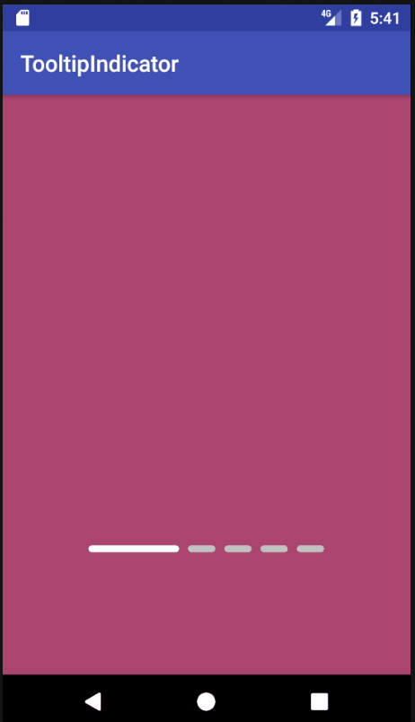

# Tooltip Indicator

[](https://android-arsenal.com/details/1/5940)
[](https://search.maven.org/#artifactdetails%7Cme.huseyinozer%7Ctooltipindicator%7C0.0.1%7Caar)
[](https://opensource.org/licenses/MIT)

An indicator with preview support that you can use in the ViewPager.



Layout:

```xml
<me.huseyinozer.TooltipIndicator
    android:id="@+id/tooltip_indicator"
    android:layout_width="wrap_content"
    android:layout_height="wrap_content"
    
    app:ti_lineWidth="24dp"
    app:ti_lineWidthSelected="80dp"
    app:ti_lineHeight="6dp"
    
    app:ti_lineMargin="4dp"
            
    app:ti_selectedLineDrawable="@drawable/tooltip_indicator_rounded_line_selected"
    app:ti_unselectedLineDrawable="@drawable/tooltip_indicator_rounded_line_unselected"

    app:ti_tooltipWidth="100dp"
    app:ti_tooltipHeight="180dp" />
```

Java:

```java
indicator.setupViewPager(viewPager);

indicator.setToolTipDrawables(Arrays.asList(
        ContextCompat.getDrawable(MainActivity.this, R.drawable.img0),
        ContextCompat.getDrawable(MainActivity.this, R.drawable.img1),
        ContextCompat.getDrawable(MainActivity.this, R.drawable.img2),
        ContextCompat.getDrawable(MainActivity.this, R.drawable.img3),
        ContextCompat.getDrawable(MainActivity.this, R.drawable.img4)
));
```


## Android Gradle

```groovy
dependencies {
  compile 'me.huseyinozer:tooltipindicator:0.0.1'
}
```

## LICENSE

(MIT)
